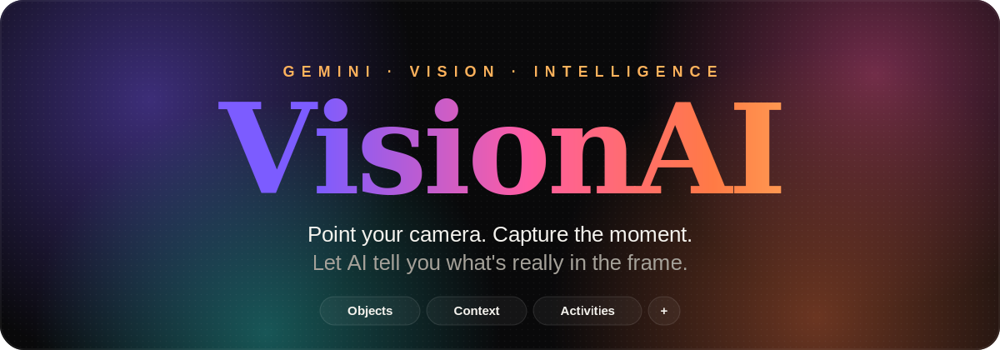
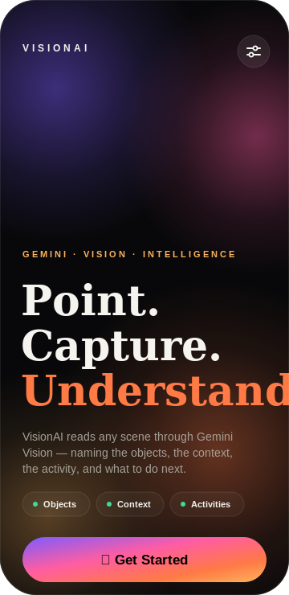
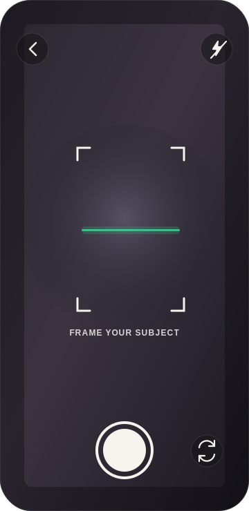
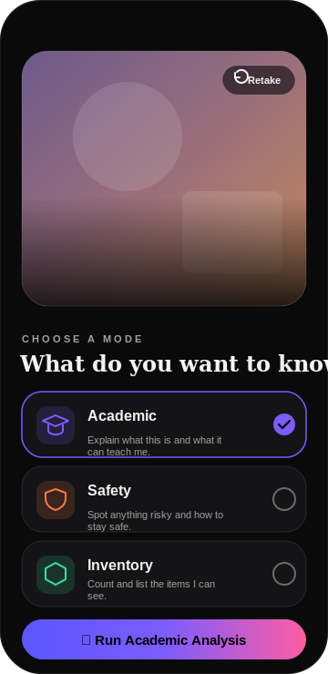
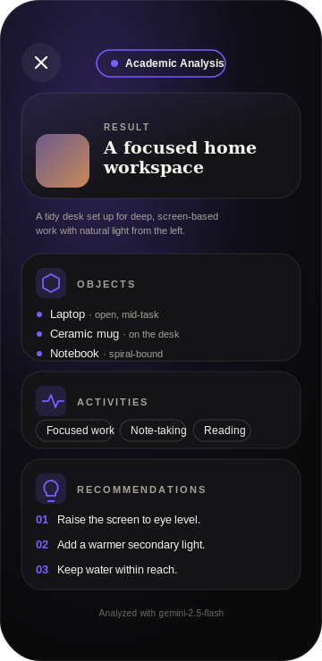

<div align="center">



<br/>

# VisionAI

**A premium mobile app that opens your camera, captures a real photo, and uses Google's Gemini Vision to tell you what's actually in the frame** — objects, scene context, activity, and recommendations.

<br/>


</div>

---

## ✦ The experience

VisionAI isn't a classroom demo — it's built to feel like a shipping AI product:
a living neo-gradient landing, a Gen-Z camera, choreographed AI loading, and
editorial result cards. Point, capture, choose a lens, and read the scene back
in seconds.

<div align="center">

| Landing | Camera | Preview · Pick a lens | Results |
|:---:|:---:|:---:|:---:|
|  |  |  |  |
| Living animated gradient, editorial type, **Get Started** | Permission-aware, framing brackets, scan line, elastic shutter | Academic · Safety · Inventory lenses | Objects, Context, Activities, Recommendations |

</div>

> 🎨 The screens above are **design mockups** rendered straight from the app's
> real color system, typography hierarchy, and layout. Live device screenshots
> drop in here once you run it on a phone — see [Getting started](#-getting-started).

---

## ✦ What it does

```
Landing  →  Camera  →  Preview (choose a lens)  →  Results
```

1. **Landing** — a premium intro with a living neo-gradient, halftone grain, and brutalist editorial type.
2. **Camera** — requests permission on first launch, captures a real photo at `quality: 0.7`, then compresses it for a fast request.
3. **Preview** — pick how AI should read the shot through one of three lenses:

   | Lens | Reads the scene as… |
   |---|---|
   | 🎓 **Academic** | Concepts, materials, and what it could teach |
   | 🛡️ **Safety** | Hazards, compliance, and protective actions |
   | 📦 **Inventory** | Items, quantities, and condition — a stock take |

4. **Results** — structured, reveal-animated cards: **Objects · Scene Context · Activities · Recommendations**, plus an optional **Roboflow** object-detection card with bounding boxes and confidence scores.

---

## ✦ Highlights

- **Real AI vision** — Google **Gemini Vision** via REST with a strict
  `responseSchema`, so every result comes back as reliable structured JSON.
- **Modular model layer** — `analyzeImage()` accepts any `VisionProvider`;
  swapping in a future Gemini model (or another backend) is a one-line change.
- **Motion-first** — Reanimated 4 powers living gradients, floating elements,
  elastic presses, card reveals, and an AI loading orb.
- **Premium design system** — dark editorial palette, **Fraunces** (display)
  + **Space Grotesk** (UI), glassmorphism, halftone grain.
- **Production-grade TypeScript** — strict mode plus `noUnusedLocals`,
  `noUnusedParameters`, `noImplicitReturns`, and more. `tsc` is clean.
- **Cross-platform** — one codebase for iOS and Android.

---

## ✦ Tech stack

| Layer | Tooling |
|---|---|
| Framework | Expo SDK 54 · React Native 0.81 · React 19 |
| Language | TypeScript (strict) |
| AI | Google Gemini Vision (REST) · optional Roboflow |
| Navigation | React Navigation (native-stack) |
| Motion | react-native-reanimated 4 + worklets |
| Camera / media | expo-camera · expo-image · expo-image-manipulator |
| UI | expo-linear-gradient · expo-blur · react-native-svg · expo-haptics |
| Type | Fraunces + Space Grotesk (`@expo-google-fonts`) |

---

## ✦ Getting started

```bash
# 1. Install
npm install

# 2. Run — scan the QR with Expo Go (SDK 54), or use a simulator/emulator
npm start
npm run ios       # iOS simulator
npm run android   # Android emulator
```

**Add your free Gemini API key** (required to run an analysis) right inside the
app: tap the **options icon** on the landing screen → paste your key → Save.
Grab one at <https://aistudio.google.com/app/apikey>.

> 📷 The camera needs a real device or a simulator/emulator with a camera.
> Full setup, optional Roboflow, and troubleshooting live in [`SETUP.md`](./SETUP.md).

---

## ✦ Project structure

```
src/
├─ screens/      Landing · Camera · Preview · Results
├─ components/   AnimatedGradient, GlassCard, AnalysisLoader, SectionCard, …
├─ services/ai/  geminiProvider · roboflowProvider · visionService (modular)
├─ context/      SettingsContext (API keys) · CaptureContext (photo + result)
├─ hooks/        useAnalysis · useAppFonts
├─ theme/        colors · typography · spacing
└─ utils/        image preparation pipeline
```

---

## ✦ Documentation

- 📐 [`DESIGN.md`](./DESIGN.md) — the full design vision and philosophy
- 🛠️ [`SETUP.md`](./SETUP.md) — detailed setup, Roboflow, and how it works

---

<div align="center">
<sub>Built with Expo + React Native · Powered by Google Gemini Vision</sub>
</div>
